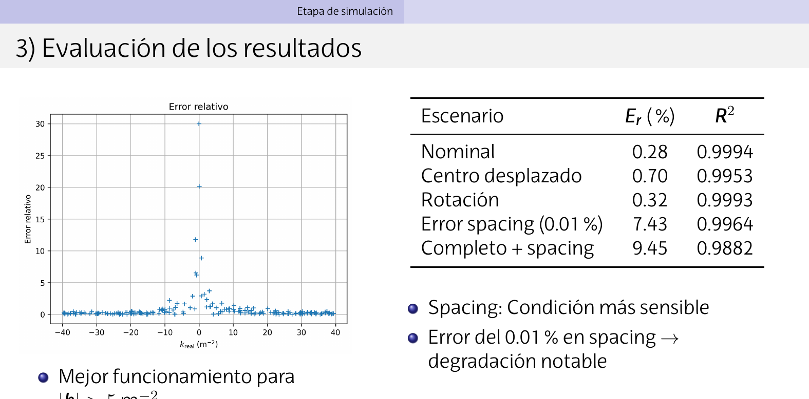
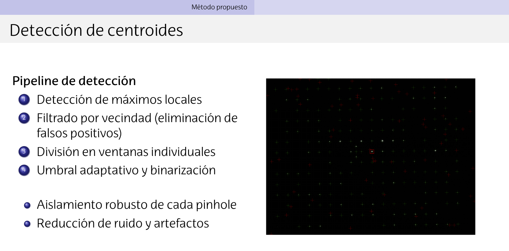
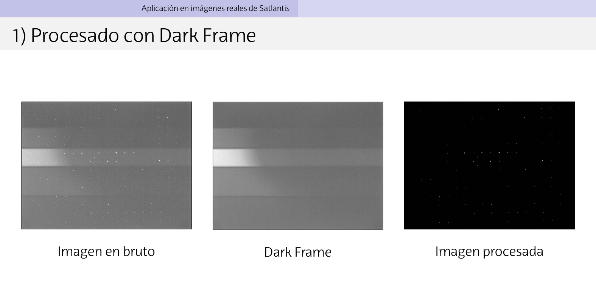
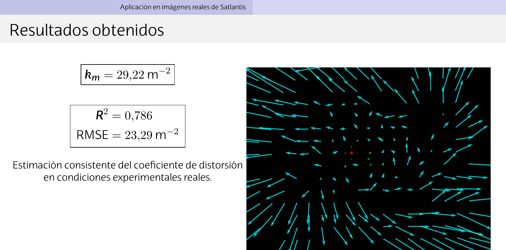

# 📷 Radial Distortion Estimation from Pinhole Images

Bachelor's Thesis (Physics, UPV/EHU) developing a pipeline to detect pinhole
centroids in an image and estimate radial optical distortion using a least
squares approach — developed and validated with real high-resolution
satellite camera data provided by **Satlantis Microsats**.

## Results

- **Validated across 800 controlled simulations** (8 systematic scenarios,
  100 runs each), isolating the effect of each real-world uncertainty source
  (optical center offset, rotation, spacing error, intensity variation).
  R² ≥ 0.98 in nominal and near-nominal conditions.
- **Applied to real Satlantis Microsats camera images**: R² = 0.79,
  k = 29.22 m⁻² — a consistent distortion estimate obtained despite
  uncontrolled experimental conditions (no flat frame available, optical
  center unknown). See [Limitations](#limitations) below.
- Full pipeline: dark-frame correction → subpixel centroid detection →
  ideal-grid matching (Hungarian algorithm) → least-squares distortion fit.

<p align="center">
  
</p>

## Pipeline overview

<p align="center">
  
</p>

1. **Preprocessing** — dark-frame correction (see below)
2. **Centroid estimation** — local maxima detection, adaptive thresholding,
   intensity-weighted subpixel centroids
3. **Ideal pinhole grid modelling** — orientation correction, pinhole-to-pinhole
   matching via the Hungarian algorithm
4. **Distortion estimation** — least-squares fit of the radial distortion
   coefficient

<p align="center">
  
</p>

### Applied to real Satlantis Microsats data

<p align="center">
  
</p>

## Limitations

The real-data validation was carried out on images that did not meet the
experimental conditions the method assumes: the pinhole plate was not
centered or aligned to the optical axis, and no flat frame was available, so
the optical center had to be approximated as the image center — a
deliberately weak assumption. Under these conditions the method still
produced a consistent, reasonable distortion estimate, but with a larger
error margin than in the controlled simulations. Full details and the
sensitivity analysis are in the [thesis report](Memoria/TFG_portada-Latex-ehu/main.pdf).

## Project Structure

```
Codigo/src/
│
├── main_distortion.py        # Distortion estimation pipeline
├── main_simulation.py        # Synthetic image simulation
│
├── Distortion/
│   ├── DistortionDetector.py
│   └── K_VALUES.py
│
├── Processing/
│   ├── FlatDark.py
│   └── OpticCenter.py
│
├── Simulation/
│   └── ImageSimulator.py
│
├── Utils/
│   └── utils.py
│
├── Visualization/
│   ├── CentroFlat.py
│   ├── CentroidValidation.py
│   ├── ErrorVisual.py
│   └── ErrorVisual2.py
│
└── requirements.txt
```

## Installation

Clone the repository:

```
git clone https://github.com/yoldi22/TFG_Yoldi.git
cd TFG_Yoldi
```

Install dependencies:

```
pip install -r Codigo/src/requirements.txt
```

## Usage

Run the distortion estimation pipeline:

```
python Codigo/src/main_distortion.py
```

Run the simulation environment:

```
python Codigo/src/main_simulation.py
```

## Applications

This project can be used for:

- Optical system calibration
- Detector characterization
- Distortion analysis
- Computer vision preprocessing

## Author

**Xabier Yoldi**
